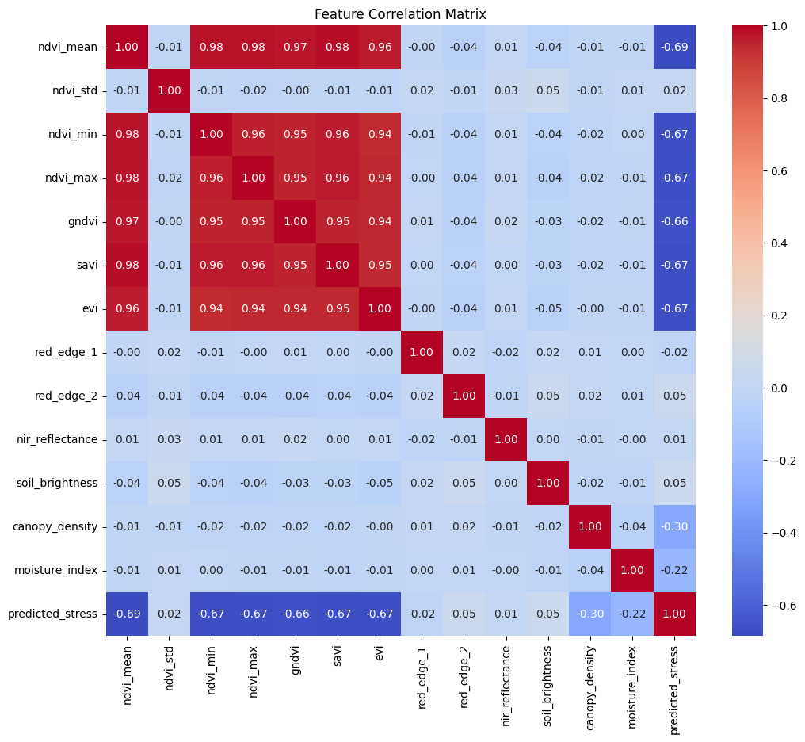
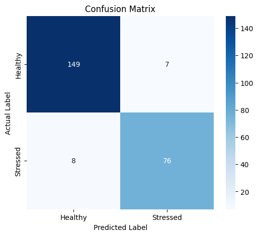
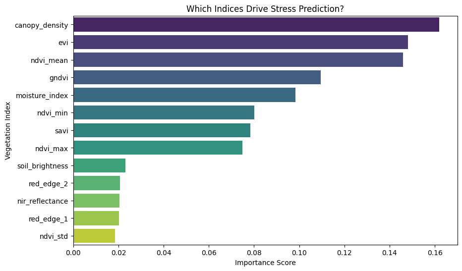
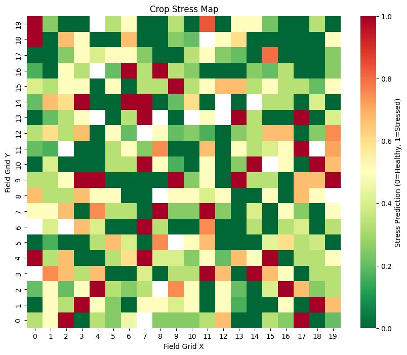

# AI-Based Crop Health Monitoring System

This project is an end-to-end Machine Learning pipeline designed to detect crop stress using drone-derived multispectral data.  
Rather than treating crop health detection as a pure classification problem, the focus here is on translating spectral signals into **spatially meaningful insights** that can actually guide field-level decisions in precision agriculture.

By working with vegetation indices such as NDVI and Red-Edge bands, the system identifies specific regions of a field that are likely under stress, allowing for targeted drone inspections and more efficient use of resources like water and fertilizer.

---

## Data and Approach

The dataset consists of processed multispectral observations derived from drone imagery.  
Key inputs include common vegetation indices (NDVI, GNDVI, SAVI, EVI), along with canopy density and moisture-related features.

Instead of immediately jumping into modeling, the first step was to understand how these spectral features relate to one another. A correlation analysis showed a very strong relationship (greater than 0.95) between indices such as NDVI, GNDVI, and SAVI.



Although such high correlation often leads to feature removal, these indices were intentionally retained. In real agricultural settings, each index captures slightly different aspects of plant physiology—such as chlorophyll concentration versus structural biomass—and keeping multiple correlated signals helps make the model more robust to noise or errors in individual spectral bands.

---

## Preprocessing and Model Training

To ensure the model learned actual plant health patterns rather than memorizing field locations, spatial coordinates (`grid_x`, `grid_y`) were removed from the training data. Crop health labels (“Healthy” and “Stressed”) were encoded for binary classification.

A Random Forest classifier was chosen due to its robustness, interpretability, and ability to handle nonlinear feature interactions. Class imbalance was addressed using `class_weight="balanced"` so that stressed regions were not overshadowed by the more common healthy samples. Model stability was verified using 5-fold cross-validation.

---

## Model Performance

The trained model performed reliably on the test set, indicating strong potential for real-world deployment.

- ROC–AUC: ~0.98  
- Accuracy: ~94%  
- Recall for stressed crops was intentionally prioritized to reduce the risk of missing early crop failures.



Feature importance analysis showed that NDVI and Red-Edge-related features were the strongest contributors to predictions, which aligns well with established agronomic understanding of crop stress indicators.



---

## Spatial Analysis and Insights

The most important step in this project was moving beyond abstract predictions and bringing the results back into a spatial context. Model outputs were mapped onto the field grid to generate a crop stress heatmap.



Rather than appearing as random noise, stress predictions formed clear spatial clusters. A particularly strong hotspot emerged in the top-left quadrant of the field, suggesting a localized underlying issue—such as a soil deficiency, irrigation inconsistency, or an early-stage pest or disease outbreak—rather than a uniform field-wide problem.

---

## Practical Recommendations

Based on the spatial patterns observed:

- The top-left quadrant should be treated as a **priority inspection zone**, with low-altitude drone flights using RGB or thermal sensors to visually diagnose the issue.
- Variable Rate Application (VRA) strategies are recommended instead of uniform treatment, concentrating resources only on stressed grid cells.
- Smaller central stress clusters should be monitored closely to prevent potential spread.

---

## Future Work

While the current pipeline performs well on processed spectral data, future improvements could significantly enhance its practical value. Integrating raw RGB imagery would allow cross-validation of spectral stress signals with visible symptoms like leaf yellowing or wilting. Incorporating temporal data would also enable tracking how stress evolves over time, helping distinguish between transient issues and rapidly spreading threats.

---

## Running the Project

**Requirements**

- Python 3.8+
- Pandas, NumPy
- Scikit-learn
- Matplotlib, Seaborn

**Steps**

```bash
pip install pandas numpy scikit-learn matplotlib seaborn openpyxl
```
run
```bash
Crop_health_analysis.ipynb
```
